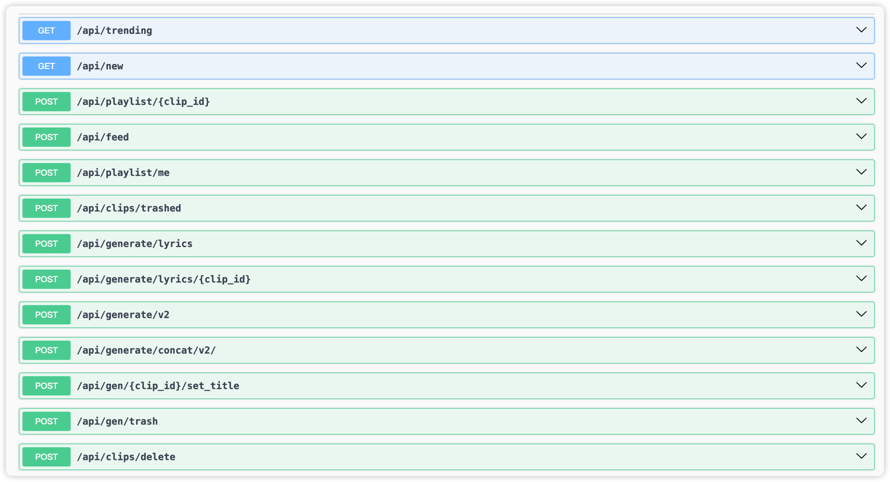

# Suno AI Proxy

## dev

```shell
npm run dev
```

## deploy

deploy to cloudflare worker

```shell
npm run deploy
```

## docs

session_id :


access_token :


[](https://app.getpostman.com/run-collection/33852586-a01c2a67-a28d-4cd4-a330-de8a50e09cb9?action=collection%2Ffork&source=rip_markdown&collection-url=entityId%3D33852586-a01c2a67-a28d-4cd4-a330-de8a50e09cb9%26entityType%3Dcollection%26workspaceId%3D447a2ca1-f96a-4187-8a1a-7556d5f7780d#?env%5BDev(suno-ai)%5D=W3sia2V5IjoiYmFzZVVybCIsInZhbHVlIjoiaHR0cDovLzEyNy4wLjAuMTo4Nzg3IiwiZW5hYmxlZCI6dHJ1ZSwidHlwZSI6ImRlZmF1bHQiLCJzZXNzaW9uVmFsdWUiOiJodHRwOi8vMTI3LjAuMC4xOjg3ODciLCJzZXNzaW9uSW5kZXgiOjB9XQ==)


swagger ui -> https://raw.githubusercontent.com/kilingzhang/suno-ai-proxy/main/docs/swagger.json



## License
Copyright © 2023 [kilingzhang][profile-link]. <br />

This project is [MIT](./LICENSE) licensed.
