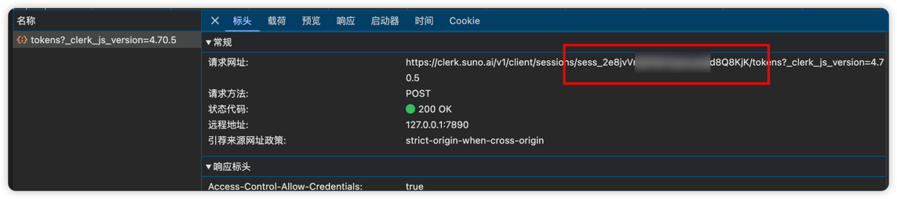
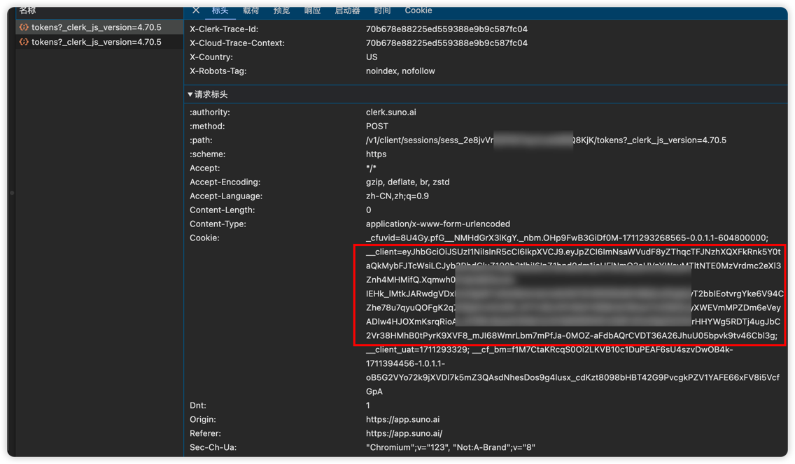

# Suno AI Proxy

## dev

```shell
npm run dev
```

## deploy

deploy to cloudflare worker

```shell
npm run deploy
```

## docs

### 1. 获取 session_id 和 access_token

session_id :


access_token : (只需要 _client 的 value 就好)




### 2. [**详细接口文档**](https://documenter.getpostman.com/view/33852586/2sA35G4NQc)


### 3. run in Postman

[](https://app.getpostman.com/run-collection/33852586-a01c2a67-a28d-4cd4-a330-de8a50e09cb9?action=collection%2Ffork&source=rip_markdown&collection-url=entityId%3D33852586-a01c2a67-a28d-4cd4-a330-de8a50e09cb9%26entityType%3Dcollection%26workspaceId%3D447a2ca1-f96a-4187-8a1a-7556d5f7780d#?env%5BDev(suno-ai)%5D=W3sia2V5IjoiYmFzZVVybCIsInZhbHVlIjoiaHR0cDovLzEyNy4wLjAuMTo4Nzg3IiwiZW5hYmxlZCI6dHJ1ZSwidHlwZSI6ImRlZmF1bHQiLCJzZXNzaW9uVmFsdWUiOiJodHRwOi8vMTI3LjAuMC4xOjg3ODciLCJzZXNzaW9uSW5kZXgiOjB9XQ==)


## License
Copyright © 2024 [kilingzhang][profile-link]. <br />

This project is [MIT](./LICENSE) licensed.


<!-- LINK GROUP -->
[profile-link]: https://github.com/kilingzhang
